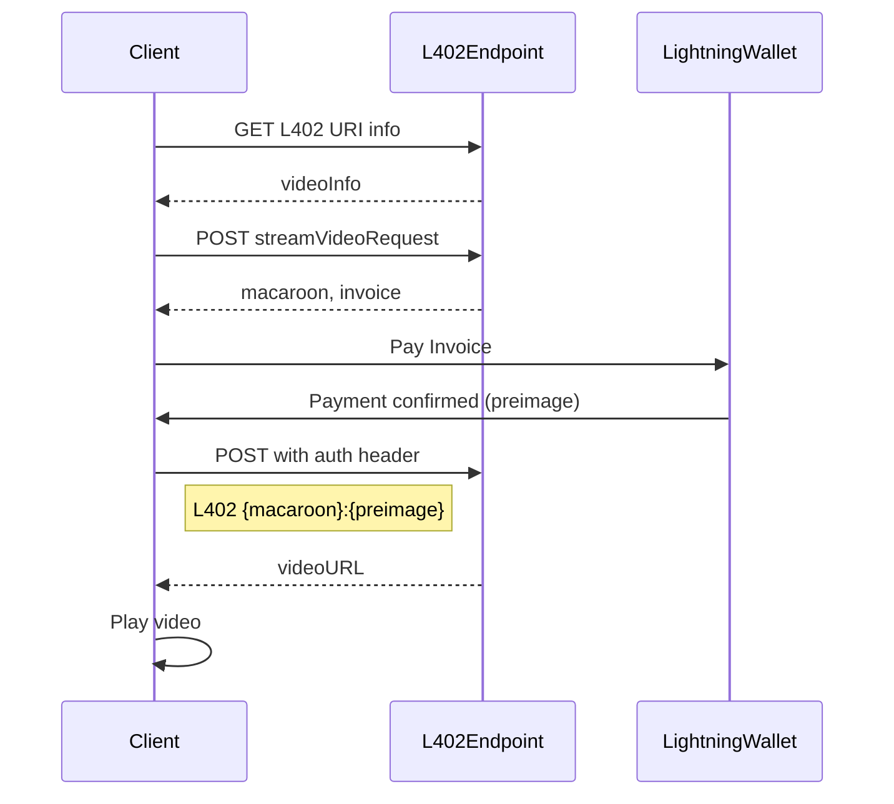

# L402 Video Streaming Client

This repository demonstrates how to implement a client to consume videos through L402 using our URI Scheme protocol.

You can try it at https://videos.l402.org/


## Getting Started

1. Clone this repository
2. Install dependencies: `npm install`
3. Run the development server: `npm run dev`


## Overall Flow

1. Parse the L402 URI to extract video information and access details.
2. Send the signed request to the L402 endpoint to receive a Lightning invoice & macaroon.
3. Display the invoice to the user (e.g., as a QR code) and wait for payment.
4. Once payment is confirmed, use the preimage and macaroon to request the video stream URL.
5. Use the received HLS URL to play the video



For a complete implementation example, refer to the source code in this repository, particularly the `useVideoFlow` hook and the `VideoPlayer` component.

## L402 URI Scheme

The L402 URI scheme provides information about L402-paywalled resources. It starts with `l402://` and contains a payload with essential information about the content, payment details, and access instructions.

### Parsing the URI Payload

```javascript
// Convert L402 URI to HTTPS URL
const url = uri.replace('l402://', 'https://');
const response = await fetch(url);
const videoInfo = await response.json();
```

The `videoInfo` object will contain a structure similar to this:

```json
{
  "version": "1.0",
  "name": "How to focus and think deeply | Andrew Huberman and Lex Fridman",
  "description": "Lex Fridman Podcast full episode:  ...",
  "cover_url": "https://pub-xxxerea.r2.dev/cover-images/79c816f77fdc4e66b8cd18ad67sfas537936",
  "content_type": "video",
  "pricing": [
    {
      "amount": 1,
      "currency": "USD"
    }
  ],
  "access": {
   "endpoint": "https://blockbuster.fewsats.com/video/stream/79c816f77fdc4e66b8cd18ad67537836",
    "method": "POST",
    "authentication": {
      "protocol": "L402",
      "header": "Authorization",
      "format": "L402 {credentials}:{proof_of_payment}"
    }
  }
}
```

You can then use this information to display a video card like this:


## Requesting Payment

To request payment, you need to send a signed POST request to the L402 endpoint with your `public key`, `domain` where the video is hosted, current `timestamp` and a signed `domain:timestamp` message . The signature and public key serve multiple purposes:

1. Proves that the request comes from private key owner.
2. Prevents unauthorized access and tampering with the request.
3. Protects against replay attacks by including a timestamp.

This approach allows for authentication without requiring traditional user accounts and previous sign up.

Here's how to create and send the signed request:

```javascript
const message = `blockbuster.fewsats.com:${timestampNow}`
const signature = signMessage(secretKey, message)
const streamVideoRequest = {
    pub_key: pubKey,
    domain: domain,
    timestamp: timestamp,
    signature: signatureHex
};

const endpointResponse = await fetch(endpoint, {
    method: 'POST',
    headers: {
        'Content-Type': 'application/json',
    },
    body: JSON.stringify(streamVideoRequest),
});
```

The response will contain the macaroon & invoice in the `Www-Authenticate` header. Example:

```
Www-Authenticate: L402 macaroon="AGIAJEemVQUTEyNCR0exk7ek90Cg==", invoice="lnbc1500n1..."
```

## Making a Payment

Either display the Lightning invoice to the user as a QR code for easy scanning with a Lightning wallet, or pay using the invoice string itself.

## Accessing the Video Stream

After payment confirmation, use the preimage and macaroon to access the video stream:

```javascript
const { hls_url, dash_url } = await fetch(endpoint, {
    method: 'POST',
    headers: {
        'Content-Type': 'application/json',
        'Authorization': `L402 ${macaroon}:${preimage}`
    },
});
```

## Displaying the Video

Use the HLS or DASH URL to stream the video. This demo uses `hls.js` library:

This demo uses `hls.js` library & `<video>` tag to stream the video. See [src/components/VideoPlayer.tsx](src/components/VideoPlayer.tsx).

For a complete implementation example, refer to the `useVideoFlow` hook and the `VideoPlayer` component in the source code.